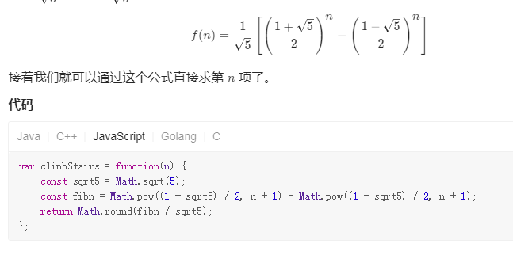

# 动态规划

- 将原问题转发为子问题
- 确定状态
- 确定边界（base case）
- 确定状态转移方程

特点

- 重叠子问题
- 最优子结构

# 斐波那契



## 爬楼梯，求多少种爬法

- 要么爬一步或者爬两步就到达
- 转移方程：dp[i] = dp[i-1]+dp[i-2]

```js
var climbStairs = function (n) {
  var dp = [0, 0, 1];
  for (var i = 1; i <= n; i++) {
    dp[0] = dp[1];
    dp[1] = dp[2];
    dp[2] = dp[0] + dp[1];
  }
  return dp[2];
};
```

华为面试变种题：增加一个不能连续跳两步的条件
推导出 f(n) = f(n-1)+f(n-3)

ABCDE
BCDE

## 求最长公共子串长度

- 子串是连续的，子序列则可以不连续但保持相对位置
- 以 test1 的前缀和 test2 的前缀构建一个二维的 dp 数组，以 test1[i]和 test2[j]结尾的最长子串长度
- 状态转移方程
  - test1[i] === test2[j], dp[i][j] = dp[i-1][j-1] + 1
  - test1[i] !== test2[j], dp[i][j] = 0
- 最后再遍历一次找出最大值

## 求最长公共子序列长度

- 以 test1 的前缀和 test2 的前缀构建一个二维的 dp 数组，值为长度
- 状态转移方程
  - `test1[i] === test2[j], dp[i][j] = dp[i-1][j-1] + 1`
  - `test1[i] !== test2[j], dp[i][j] = Math.max(dp[i-1][j], dp[i][j-1])`
- 最终的 dp[i][j]就是最大长度值

## 01 背包

- 题意：在规定背包重量内价值最大，每个物品只能选一次
- 以背包重量和物品编号构建一个二维的 dp 数组，值为最大价值
- 状态转移方程
  - 放物品 i, `dp[i][j] = max(dp[i-1][j], dp[i-1][j - weight[i]] + value[i]);`, 条件: `j >= weight[i]`
  - 不放物品 i, `dp[i][j] = dp[i-1][j]`
- 一维优化
  - 遍历背包重量时从大到小遍历（为了保证每个物品仅被添加一次）
  - `dp[j] = Math.max(dp[j], dp[j - weight[i]] + value[i])`

## 完全背包

- 题意：在规定背包重量内价值最大，每个物品可以选多次
- 不同背包重量下的最大价值
- 状态转移方程：
  - 放物品 i, `dp[i][j] = max(dp[i-1][j], dp[i][j - weight[i]] + value[i]);`, 条件: `j >= weight[i]`
  - 不放物品 i, `dp[i][j] = dp[i-1][j]`
  - 一维优化
    - 遍历背包重量时从小到大遍历（因为遍历到高重量的时候，低质量时可能已经选过一些物品了）
    - `dp[j] = max(dp[j], dp[j - weight[i]] + value[i])`
