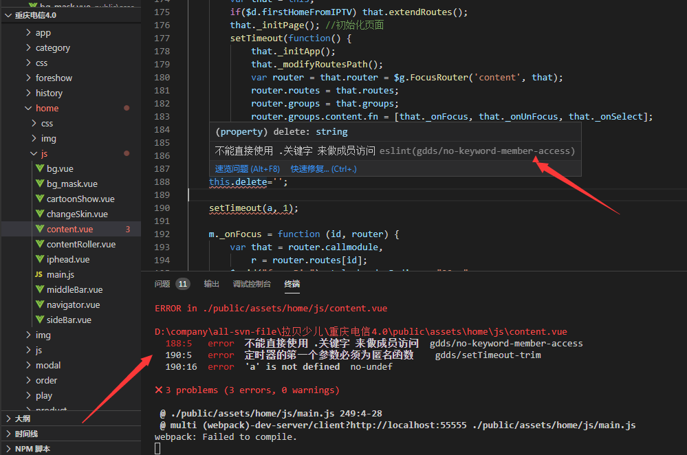

## 对公司的一次 自定义 eslint 插件及 webpack 优化

阅读本文的基础要求

- 熟悉前端项目 webpack 打包的基本原理
- 熟悉 eslint 的 rule 规则和 plugin 插件用法

?> 下面有概念不理解，请自行查阅 [webpack 文档](https://www.webpackjs.com/concepts) 和 [eslint 文档](https://eslint.bootcss.com) 了解。

### 前言背景

我们的前端项目使用 webpack 进行代码的模块化开发，以`webpack.config.js`中`entry`配置的文件路径作为`入口`，后被 webpack 编译打包至`output`定义的输出路径上面去。其中 webpack 会根据配置中提供的 loader 对 import 或 require 进来的模块进行预处理操作，在这其中我们的前端项目引入了 eslint-loader 对代码进行检测，还引入了自定义的 loader.js（这个文件在项目的根目录）对 vue 文件进行代码转换工作。

#### loader.js 做了两件事情

1. 对 js 和 vue 文件，除 eslint 自己推荐的 recommended 规则检查外，我们还做了自己定义特殊的语法检查
2. 仅对 vue 文件代码做拆分修正处理，把 template 标签中的 html 代码放入`m.__html__`中，用于后续渲染。并且，提取模块中定义的 css 代码合并到标签上 lang 定义的文件路径中去，最终只保留 js 代码交给 webpack 做下一步工作。

#### 整个设计存在以下几个缺点：

- 在编辑器（如 vscode 中）安装了 eslint 插件的情况下，对自定义的规则是没有检查到的，仅经过 webpack 打包才有所检查
- 当代码开发中出现不满足规则时，仅提示了哪个文件出错，没有提示代码是哪行哪列出错
- loader.js 代码的正则的写法不易理解与维护
- loader.js 代码中新增自定义规则困难

!> 文章中提到的编辑器都是以 vscode 为准，webstorm、Sublime 等编辑器配置，请自行 [百度](http://www.baidu.com/)

#### 基于以上出现的问题，对 eslint 的用法和打包进行优化改进

- 引入 eslint-plugin-vue 插件，配合 eslint 对 vue 代码在开发阶段以及打包阶段对代码进行检查
- 运用 eslint 自定义插件的方式代替 loader.js 中特殊的代码检查，引入 eslint-plugin-gdds 这个 npm 包

##### 对 eslint-plugin-gdds 包的介绍

这个 npm 包是我在 [npmjs](https://www.npmjs.com) 上的用 gdds 发布的一个公共的 node_module 模块包

为什么使用 npm 包原因：

1. eslint 的插件就是要以 npm 包的形式进行引入
2. 因为不涉及公司隐私问题，以公共包的方式更方便

!> 这里就不细讲 eslint-plugin-gdds 插件内的代码了，如果要新增规则的话，可以先看看这个人的[eslint-plugin 入门](https://www.jianshu.com/p/f3fddccb059a)，然后再看 eslint-plugin-gdds 里面的代码就知道怎么做了。更多细节可查看[eslint 文档](https://eslint.bootcss.com/docs/developer-guide/working-with-plugins)

!> npm 发包细节这里也不讲，可以参照这个例子[手把手教你用 npm 发布包](https://blog.csdn.net/taoerchun/article/details/82531549)

##### 对于我们的前端项目，改动的文件包括：

1. loader.js

```js
/* 把特殊的语法检查的相关代码去掉，仅保留拆解vue文件的相关代码 */
```

2. package.json

   ```js
   /* dev新增两个依赖，eslint-plugin-gdds和eslint-plugin-vue */
   {
      "devDependencies": {
        "eslint-plugin-gdds": "*",
        "eslint-plugin-vue": "^6.2.2"
      }
   }
   ```

3. public/assets/.eslintrc.js

```js
/* 以下是关键改动 */
{
  extends: [ /* 扩展eslint检查,引入插件中定义好的一套规则 */
      'plugin:gdds/recommended',
      'plugin:vue/essential',
      'eslint:recommended'
  ],
  plugins: [ /* 引入eslint-plugin-gdds和eslint-plugin-vue两个插件 */
      'gdds',
      'vue'
  ]
}
```

4. webpack.config.js

```js
/* rules中所有loader的执行顺序是从下往上，use中的loader是从右往左，但可以通过配置enforce字段来改变这些规则的执行顺序 */
{
  module: {
    rules: [
      {
        test: /\.js$/,
        exclude: /node_modules/,
        loader:
          "eslint-loader" /* 之前这个地方也进行loader.js的规则，现在去掉了 */,
      },
      {
        test: /\.vue$/,
        exclude: /node_modules/,
        /* 这里要先执行eslint-loader，因为里面包含了vue的一些语法检查 */
        use: [
          { loader: "./loader.js?dir=" + __dirname },
          { loader: "eslint-loader" },
        ],
      },
    ];
  }
}
```

##### 代码出错检查示例



上图可以看到

- 代码在开发或打包时，能清楚地代码在哪行哪列出错
- 编辑器也能看到有红红的波浪线提示语法错误

?> 优化代码递交至 [重庆电信 4.0](http://121.199.61.174:18080/svn/kids/branches/chongqin/iptv4.0) svn 地址，更多细节可下载代码慢慢研究。

!> 重庆电信这边的服务器 node 版本是 6，所以还对低于 8 的 node 版本做了兼容，打包的时候不经过 eslint 插件的检查，仅做 eslint 的 recommended 检查，虽然有风险，但是出现问题的概率很低，因为在开发阶段就能很明显的发现代码错误并及时纠正了。所以还是建议把服务器版本都升级到 8 以上，根除这个风险。

### 总结及建议

1. 开发者请使用 node8 版本以上进行开发，不然 eslint 包运行起来会报错。
2. 所有前端开发者的编辑器都应该安装 eslint 插件并确认开启，按.eslintrc.js 中定义的规则规范来进行代码开发
3. 编辑器安装 eslint 插件，在 settings.json 中加入以下配置

```js
    "editor.codeActionsOnSave": {
        "source.fixAll.eslint": true
    }
```

### 题外优化

对 webpack-dev-server 的用法进行了改进，解放前端开发时对 app-config.js 上 static_host 字段的依赖

```js
devServer: {
        contentBase: false,
        historyApiFallback: true, // 不跳转
        port: 55555,
        publicPath: "/assets/app/",
        inline: true,
        open: true,
        proxy: {
            '/': {
                target: `http://127.0.0.1:${appconfig.SERVER.LISTEN_PORT}`,
                changeOrigin: true,
                bypass(req, res, proxyOptions) {
                    if (req.path === '/') {
                        res.redirect('/enter/1?userId=dongshiwangluo');
                    }
                }
            }
        }
    },
```

这里主要是新增 proxy 字段，通过代理的方式，后端所有请求都被代理到前端这个服务上面去。并且，在开启前端开发服务的时候，自动跳转到 enter 地址去，不用自己手敲了

### 遗留问题

- 活动和专题的代码在开发的时候，如果没有开启编辑器的 eslint 插件，是发现不了代码存在的缺陷，因此是不是应该把活动和专题的代码开发都经过 webpack，这样能提前发现问题
- 没有对代码进行 UglifyJsPlugin 优化，因为有些机顶盒子太烂，压缩后的语法不支持
- 没有对 views 中的 html 文件做 eslint 检查
